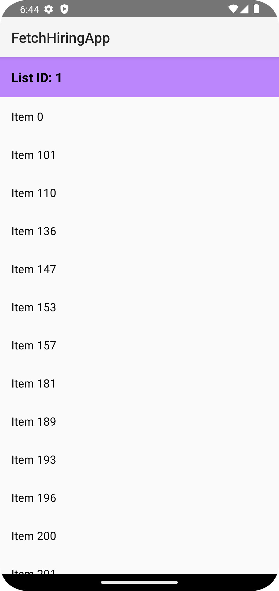
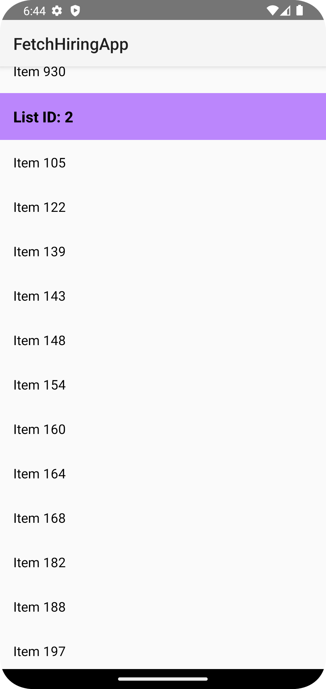

# Fetch Hiring App

This is a native Android app developed in Kotlin for Fetch Rewards' coding exercise. The app fetches a list of items from an API and displays them, grouped and sorted by `listId` and `name`.

## Features
- Fetches data from an API
- Displays items grouped by `listId`
- Sorts items by `listId` and `name`
- Filters out blank or null names

## Screenshots




## Setup Instructions

To set up and run the project locally:

1. Clone the repository:
   ```bash
   git clone https://github.com/indeevarat/FetchHiringApp.git

2. Open the project in Android Studio.

3. Run the app on an emulator or device.